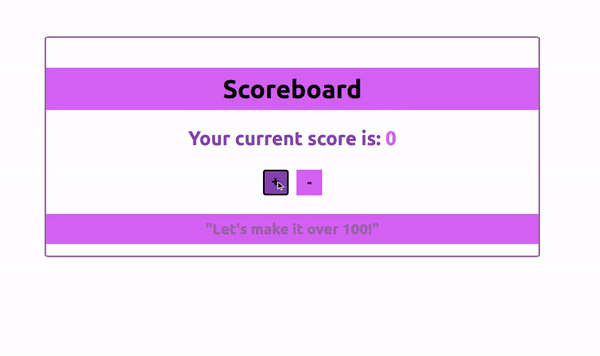

# Simple Scoreboard

## Exercise Course-Module 3 - Single Page Application (SPA) - HTML/CSS/JavaScript/React.js

created at 07.03.23;

Created a Scoreboard React App oriented to the Mockup by using different components and React Hooks `useState` and `useContext`.
In an [ScoreContext.js-file](./scoreboard/src/context/ScoreContext.js) I declared a state variable called 'score' with an initial value of 0, and wrote two functions:
`plusScore(): score + 10`,
`minusScore(): score - 10`
By using the 'value' prop, these three ('score', 'plusScore', 'minusScore') are accessible from child components.
With `useContext` and `ScoreContext` the values are accessed as 'score' for h2 and as an event plusScore/minusScore for each button on click in the [Scoreboard.js-file](./scoreboard/src/components/Scoreboard.js)
In an [Infoboard.js-file](./scoreboard/src/components/Infoboard.js) I wrote a function for changing the content of a `h3` from "Let's make it over 100!" to "Good job!" once the score is over 100 by also utilizing the 'score' from the context.

### Mockup

### My Version

